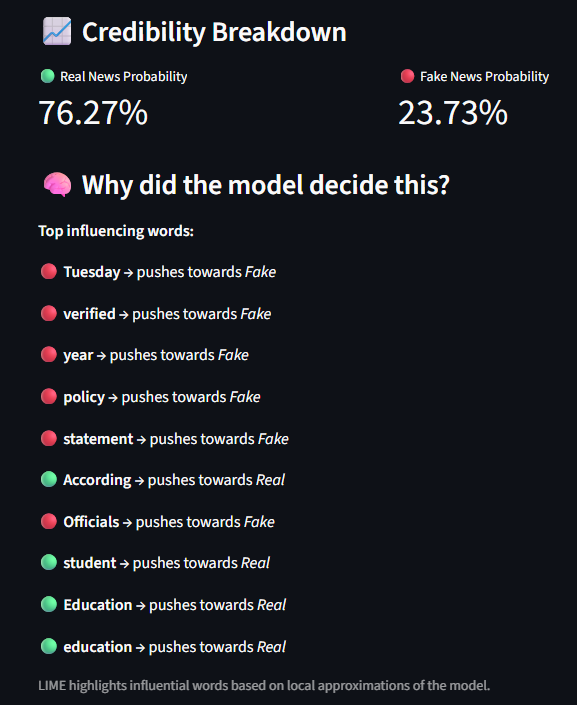

# 📰 AI News Credibility Checker

An **AI-powered web application** that evaluates the credibility of news articles using **Natural Language Processing (NLP)** and **Explainable AI**.  
The system not only predicts whether news is *Real or Fake*, but also **explains why** the prediction was made.

---

## 🚀 Features

- ✅ Fake vs Real News Classification  
- 📊 Probability-based Credibility Score  
- 📈 Real vs Fake Percentage Breakdown  
- 🧠 Explainable AI using **LIME** (highlights influential words)  
- 🌐 Interactive Web App built with **Streamlit**  
- ♻️ Reproducible Machine Learning pipeline  
- 🧪 Model evaluated using standard ML metrics  

---

## 🧠 How It Works

1. User pastes a news article into the web app  
2. Text is cleaned and preprocessed  
3. Features are extracted using **TF-IDF Vectorization**  
4. A **Logistic Regression** model predicts credibility  
5. Output includes:
   - Credibility Score (%)
   - Real vs Fake probabilities  
6. **LIME** explains which words influenced the decision  

⚠️ This tool provides **AI-assisted credibility analysis** and does not replace human fact-checking.

---

## 🛠️ Tech Stack

- Python  
- Scikit-learn  
- Pandas  
- NumPy  
- NLTK  
- Streamlit  
- LIME (Explainable AI)  
- Joblib  
- Git & GitHub  

---

## 📂 Project Structure
news-credibility-checker/
│
├── app.py # Streamlit web application
├── train_model.py # Model training & evaluation
├── requirements.txt # Dependencies
├── README.md # Documentation
├── .gitignore
│
├── data/ # Dataset files
├── model/ # Saved models (ignored in git)
├── screenshots/ # App screenshots


---

## 📊 Model Evaluation

The model is trained using a **train-test split** and evaluated using:

- Accuracy  
- Precision  
- Recall  
- F1-score  

This ensures the model generalizes well to unseen news articles.

---

## 🧠 Explainable AI (Why This Matters)

Instead of acting as a black box, the model explains predictions using **LIME**.

Examples:
- 🟢 *official*, *confirmed*, *report* → pushes towards **Real**
- 🔴 *shocking*, *you won’t believe*, *secret* → pushes towards **Fake**

This improves **transparency, trust, and usability**.

---

## 🖥️ How to Run Locally

### 1️⃣ Clone the repository
```bash
git clone https://github.com/chuyong-1/news-credibility-checker.git
cd news-credibility-checker
python -m venv venv
venv\Scripts\activate
source venv/bin/activate
pip install -r requirements.txt
streamlit run app.py
```
## 📸 Screenshots

### ✅ Real News Prediction


### 🧠 Explainable AI – Real News


---

### ❌ Fake News Prediction


### 🧠 Explainable AI – Fake News


⚠️ Limitations

Text-only analysis (no images or videos)

Dataset bias may affect predictions

No real-time fact-checking against live sources

Predictions should be used as supporting signals only

🌱 Future Improvements

Transformer-based models (BERT / DistilBERT)

Source credibility scoring using URLs

Chrome browser extension

Multilingual support

Blockchain-backed credibility verification

👨‍💻 Author

Chuyong
Computer Science (AI & ML)
Interested in AI, Machine Learning, and trustworthy information systems

📄 License

This project is licensed under the MIT License.

⭐ Support

If you find this project useful, feel free to ⭐ star the repository.
Feedback and suggestions are welcome!


---

## ✅ FINAL STEP (VERY IMPORTANT)

After pasting and saving:

```bash
git add README.md
git commit -m "Finalize README with proper formatting and screenshots"
git push origin main


Then refresh GitHub (Ctrl + Shift + R).